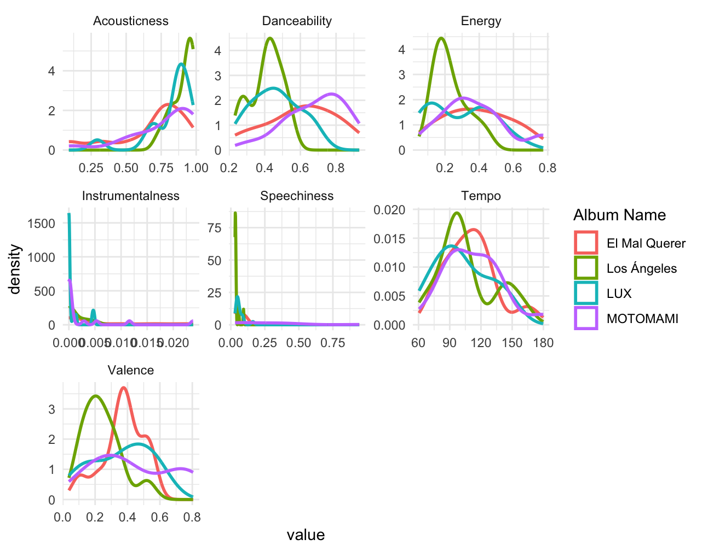
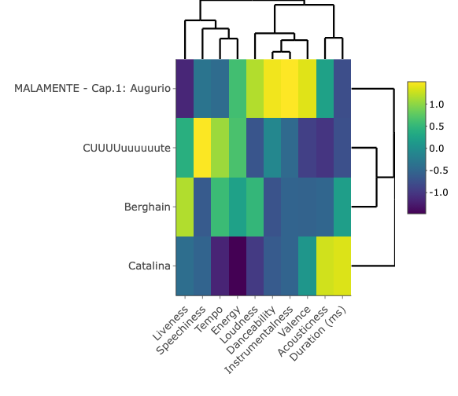

# Rosalia's Musical Evolution throughout her Studio Albums

## Introduction

This portfolio investigates the artistic and sonic evolution of Rosalía, a Spanish artist whose work bridges traditional flamenco roots with experimental pop and electronic production. In this project, I will apply computational musicology techniques to trace how her sound has transformed across her studio albums, from her debut to the most recent release in 2025.

Before starting with the most technical side of this research, I would like to introduce the artist about whom I will be talking about. Rosalía Vila Tobella, known simply as Rosalía, is a Spanish singer, songwriter, and producer born near Barcelona in 1992 who has become one of the most influential figures in contemporary global pop. Influenced by flamenco artists such as Camarón de la Isla, she started her formal musical training at a very young age in the Escola Superior de Música de Catalunya (ESMUC), where she specialized in flamenco. Her final degree project at ESMUC, inspired by the medieval Occitan novel *Flamenca*, crystallized in her second studio album "El mal querer", conceived as a chapter‑based concept album. From there, with *Motomami* and later releases, Rosalía expands her palette even further into reggaeton, hyperpop, electronica, bachata, and other genres, while maintaining a strong sense of conceptual unity. Her combination of narrative concepts with a more experimental sound took her to the top turning her into one of the most internationally-recognized Spanish artists of all time. 

Going back to the investigation, in order to make it more focused, I will be analyzing one representative song from each of her released studio albums: "Los Angeles" (2017), "El Mal Querer" (2018), "Motomami" (2022) and "Lux" (2025). With this, I aim to analyze measurable musical features such as tempo, harmonic complexity, timbral qualities, and production layers while considering the aesthetic shifts that define each period of her career.

This study seeks to uncover whether Rosalía’s musical trajectory shows a linear progression, or maybe presents cyclical returns to earlier sounds that defies clear continuity. The combination of data-driven analysis and aesthetic interpretation aims to highlight how technology can illuminate the artistic evolution of one of the most dynamic figures in contemporary music. 

## Four Chosen Songs 

The four chosen representative songs for this project are going to be: *Catalina*, *Malamente*, *CUUUuuuuuute* and *Berghain*. Here is a short explanation of this choice. 

1. *Catalina* from "Los Angeles": it is one of the most tradition-rooted songs from
Rosalia’s discography. It really represents the earlier stage of her career where
there is a predominance of flamenco elements in her music. Also, it is a low-
production track that exemplifies the low budget she had when producing this first album.

2. *Malamente* from "El Mal Querer": according by many, her biggest hit and the song that made her known internationally. It perfectly encapsulates her revolutionary fusion approach: the song opens with spontaneous flamenco handclaps ("palmas") layered over moody electronic synth pads. Lyrically, it explores the theme of grief moving to a more personal storytelling than her previous album.

3. *CUUUuuuuuute* from "Motomami": this track represents the peak of Rosalía's hyperpop experimentation and one of the most radical sonic departures in her music career. This track embodies the album's core concept of "Motomami": ultra-processed, glitchy synth leads, pitch-shifted vocal chops: it is hypnotic. Lyrically, it starts mentioning topics related with God, which will be the guiding line of her next and most recent album. 

4. *Berghain* from "Lux": the presentation song (lead single too) of her most recent album "Lux" revolutionized everyone on first listen. Completely different from everything else she has done,
a new aesthetic direction. Named after Berlin's legendary techno club, the track marks her  immersion into the dark. She abandons entirely the flamenco-pop and hyperpop hybrids of her previous work for something genuinely unknown to her music catalog. 

That being said, let's get into the most technical analysis of these four songs. 

# Audio Feature Analysis

## Spotify Features

To trace Rosalía's  sonic evolution across her four representative tracks, I selected seven key Spotify audio features that best capture her transformation from intimate flamenco to electronic maximalism: acousticness, danceability, energy, tempo, and valence.

Each feature illuminates a different dimension of her artistic journey: acousticness reveals her shift from raw flamenco guitar to a studio-processed electronic sound; danceability portrays how her music becomes more club-friendly over time; energy measures the dynamic intensity shifts that her music has from her first to her last album; and valence maps the emotional arc from melancholic flamenco to euphoric hyperpop. Loudness will appear later in the similarity analysis section.

Here is a line plot to give a preview of all the features. 

{width=50% height=400px}

After introducing the individual Spotify audio features, the next step is to see how they work together across the four songs. Instead of looking at one feature at a time, the heatmap below combines them into a single view, so we can compare the overall “feature profile” of each track and see which songs are most alike or most different in their sonic fingerprint.

{width=50% height=400px}

In this heatmap, each row represents one of the four songs and each column is a Spotify feature. The colors indicate the normalized feature values: brighter colors show relatively higher values for that feature in that song, while darker colors indicate lower values. The dendrograms on the top and right group together songs and features that behave similarly, allowing us to see, for example, which tracks cluster because they share high danceability and loudness, or which features tend to co‑vary across Rosalía’s work.

Specifically, analyzing the acousticness, energy, danceability, valence, and loudness across the four tracks reveals clear patterns in Rosalía's evolution. 

- **Acousticness**: there is a clear shift from traditional, organic sound toward fully electronic production. In *Catalina*, acousticness is at its highest, reflecting a raw, intimate sound dominated by flamenco guitar and low processed vocals. With *Malamente*, there is a noticeable decline: while electronic elements begin to emerge, the track still preserves a sense of organic texture, particularly when it comes to the vocals. This transition becomes much more noticeable in *CUUUUuuuuuute*, where acousticness drops significantly, giving way to hyper-processed synths, more vocal manipulation, and more complex production techniques. Finally, *Berghain* represents the extreme end of this evolution, with near-zero acousticness, which is brought by a fully electronic sound devoid of traditional acoustic elements. Together, these tracks demonstrate a clear progression from flamenco-rooted authenticity to experimental and high-constructed sonic environments.

- **Energy and Danceability*: in *Catalina*, both energy and danceability are very low, reflecting the rhythmic freedom and expressive timing typical of flamenco, where strict metric regularity is less central. With *Malamente*, there is a clear shift: energy rises to a moderate level and danceability increases to the highest driven by the introduction of trap-influenced beats. This evolution shifts again in *CUUUUuuuuuute*, where danceability is still strong alongside high energy, suggesting a strong orientation toward hyperpop and club-ready production. Finally, *Berghain* represents the culmination of this trajectory, with the highest energy. This is shaped by a steady techno 4/4 pulse that maximizes rhythmic consistency.

- **Valence**: when it comes to valence, the evolution is less linear. But there is a clear distinction between *Catalina* and *Malamente*, and *CUUUUuuuuuute* and *Berghain*. The first two have lower levels of valence, which translates into a more nostalgic sound. In *Catalina* this nostalgia is conveyed by the flamenco quejío whereas in *Malamente* it is brought by the brightness typical of the pop music genre. *CUUUUuuuuuute* and *Berghain* are way more melodic tracks. Rosalia is clearly looking for a more transcendental sound leaving aside the intensity in the lyrics that her first two albums had. 

- **Loudness**: this last feature emphasizes the professionalization in her production. 

In general, there is a linear progrssion in the evolution of Rosalia's sound. 

# Structural Analysis

## Cepstrograms

(Insert plots + interpretation)

## Tempograms

(Insert plots + interpretation)

# Similarity Analysis

## Dendrograms

(Your clustering + explanation)

# Conclusion

Final insights
